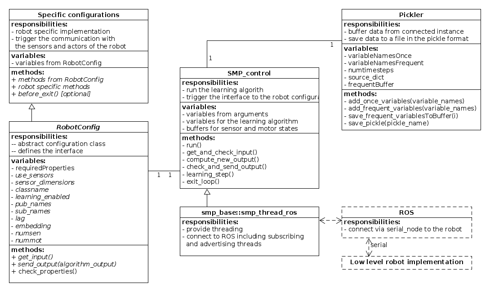

# smp_control

This package is a python implementation of the self exploration algorithms of [R.Der and G.Martius](http://playfulmachines.com/). The implementation is [ROS](http://www.ros.org/) enabled and is usable for any robot which has a strong and simple sensory motor connection.

## Robots
This package was configured and tested with the robots in the following packages:
- [demoPuppy](https://github.com/AndreasGerken/demoPuppy)
- [torqueControlledPendulum](https://github.com/AndreasGerken/torqueControlledPendulum)

A in depth sphinx documentation can be found [here](http://htmlpreview.github.io/?https://github.com/AndreasGerken/smp_control/blob/master/docs/_build/html/index.html).

## Classes
The following diagram shows an class overview of the classes. It was created with [UMLet](http://www.umlet.com/)

